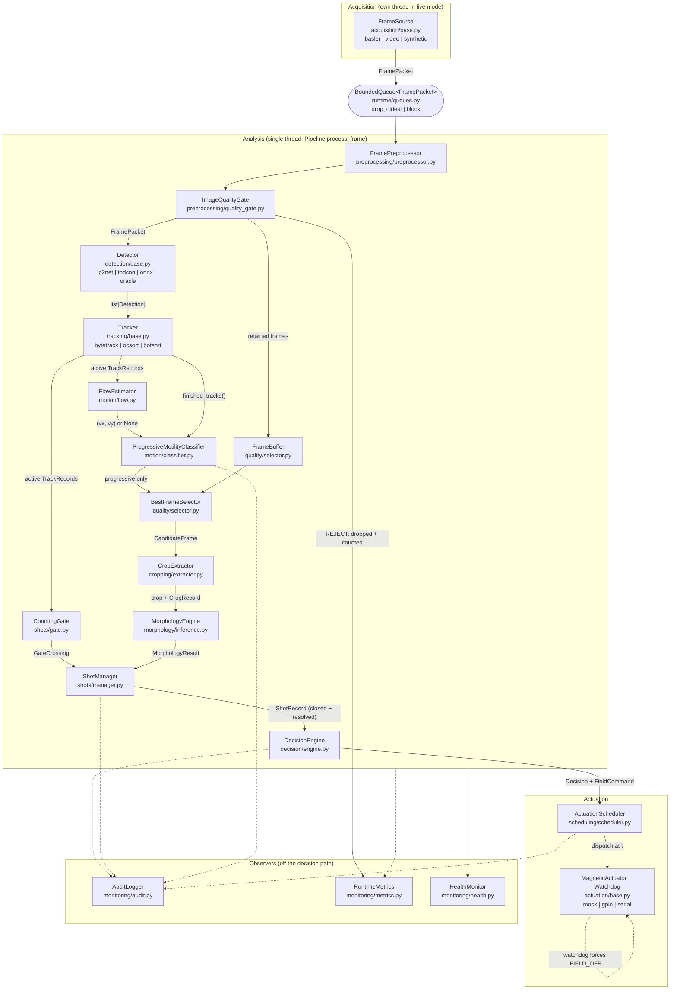
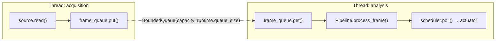

# Architecture

The component graph, the data contracts between components, and the reasoning
behind the four structural decisions that are easiest to get wrong: the
schema-type split, the back-pressure policy, the threading topology, and the
existence of a deterministic synchronous path.

The processing *order* and the invariants it protects are in `docs/pipeline.md`.
This document is about shape, not sequence.

---

## 1. The component graph

Sixteen named components carry a frame from the sensor to the magnet. Three more
-- the audit logger, the metrics collector and the health monitor -- observe that
chain without participating in it, and one, the clock, is injected everywhere
time is read.

### 1.1 Component index

| # | Component | Module | Responsibility |
|---|---|---|---|
| 1 | `FrameSource` | `acquisition/base.py` (+ `basler.py`, `video.py`, `synthetic.py`) | Produce `FramePacket`s with honest timestamps and explicit drop counts |
| 2 | `FramePreprocessor` | `preprocessing/preprocessor.py` | ROI, optional inversion, rolling-median background subtraction, intensity normalisation |
| 3 | `ImageQualityGate` | `preprocessing/quality_gate.py` | PASS / DEGRADED / REJECT per whole frame |
| 4 | `Detector` | `detection/base.py` (+ `p2net`, `todcnn`, `onnx_detector`, `oracle`) | Sperm **heads** as boxes in source-frame pixels |
| 5 | `Tracker` | `tracking/base.py` (+ `bytetrack`, `ocsort`, `botsort`) | Persistent, never-reused track identity |
| 6 | `FlowEstimator` | `motion/flow.py` | Bulk transport vector or field, to be subtracted |
| 7 | `CountingGate` | `shots/gate.py` | One-way virtual line; each track crosses exactly once |
| 8 | `ShotManager` | `shots/manager.py` | Assemble crossings into shots; hold each open until its members resolve |
| 9 | `ProgressiveMotilityClassifier` | `motion/classifier.py` | Flow-corrected kinematics to a WHO four-category grade |
| 10 | `FrameBuffer` | `quality/selector.py` | Keep frames alive long enough for a whole track's history to be re-examined |
| 11 | `BestFrameSelector` | `quality/selector.py` | Of the frames in which *this* track was seen, which is the best look at it |
| 12 | `CropExtractor` | `cropping/extractor.py` | Padded, letterboxed, normalised crop bound to its track id |
| 13 | `MorphologyEngine` | `morphology/inference.py` | Four independent binary aspects, deadline-honouring |
| 14 | `DecisionEngine` | `decision/engine.py` | The ratio rule; ACCEPT / REJECT / INDETERMINATE |
| 15 | `ActuationScheduler` | `scheduling/scheduler.py` | Future-dated `FieldCommand`s on a monotonic timeline |
| 16 | `MagneticActuator` (+ `Watchdog`) | `actuation/base.py` (+ `mock`, `gpio`, `serial_actuator`) | The one physical output bit, and the safety net under it |

Observers: `AuditLogger` (`monitoring/audit.py`), `RuntimeMetrics`
(`monitoring/metrics.py`), `HealthMonitor` (`monitoring/health.py`). Injected
time: `Clock` (`scheduling/clock.py`), with `MonotonicClock` in production and
`ManualClock` in replay and tests.

Assembly is `Application.setup()` in `app.py`, in a deliberate order: seed and
logging, then the audit log (so failures during the rest of startup are
recorded), then the actuator driven immediately to FIELD_OFF, then the models
and the frame source (the parts most likely to fail), and the scheduler **armed
last** and only if the kit timing is calibrated. Shutdown reverses it, and the
field goes off first.

---

## 2. Data contracts

Every arrow in the graph carries one of a small set of types, all defined in
`src/sperm_sorting/schemas/`.

| Type | Carries | Notes |
|---|---|---|
| `FramePacket` | `image` (2-D `uint8`/`uint16`), `capture_time_s`, `timestamp_source`, `source_kind`, `dropped_before`, `quality`, `roi`, `meta` | Monochrome always -- the target camera has no colour filter array and nothing downstream assumes three channels. `frame_id` is strictly increasing and **gap-free**: drops are reported in `dropped_before`, never inferred from a gap. |
| `Detection` | `frame_id`, `BoundingBox`, `score`, `class_id`/`class_name`, `capture_time_s`, `track_id` | Boxes are `(x1, y1, x2, y2)` in **source-frame pixels**, `x2`/`y2` exclusive. Every detector undoes its own resize/tiling; nothing downstream knows the detector's internal geometry. `track_id` is `None` until the tracker fills it. |
| `TrackPoint` | `frame_id`, `capture_time_s`, `box`, `score`, `observed` | `observed=False` means the position was predicted by the motion model. Motion analysis excludes those points; best-frame selection refuses to crop at one. |
| `TrackRecord` | `points`, `motion`, `crop`, `morphology`, `shot_id`, gate crossing, `track_quality_pass`, `ai_eligible`, `ineligibility_reason` | The accounting unit of the whole product: one physical sperm, one persistent ID, counted exactly once. The eligibility rule lives here, in `compute_eligibility()`, and nowhere else. |
| `MotionFeatures` | VCL/VSL/VAP in three variants (raw px/s, corrected px/s, corrected um/s), LIN/STR/WOB, ALH, BCF, geometry, the flow actually subtracted, the grade and its reason | Micrometre fields are `None` unless an optical calibration was loaded. ALH and BCF carry their own `*_unavailable_reason` strings. |
| `CropRecord` | `track_id`, `frame_id`, `source_box`, `output_size`, `quality_score` and its per-term breakdown, `truncated`, `visible_fraction`, `tail_complete`, `max_overlap_iou` | `track_id` is duplicated here **on purpose**, so that "the crop belongs to the same tracked cell whose motion was measured" is checkable rather than assumed. |
| `AspectResult` / `MorphologyResult` | `p_normal` and `threshold` per aspect; `status`, `model_id`, `weights_provenance` | Four independent binary decisions, never averaged. A missing aspect is *not* normal: `is_complete` is false, so `all_four_normal` is false. |
| `ShotRecord` | `track_ids` (the denominator), `eligible_track_ids` (the numerator), gate span, close reason, status, `threshold_applied`, `ineligibility_histogram` | The ratio arithmetic lives here and nowhere else. |
| `FieldCommand` | `kind`, `origin`, `activate_at_s`, `dispatch_at_s`, `deadline_s`, `outcome`, `timing_error_s` | A future-dated instruction: created when a shot is decided, executed when that fluid reaches the magnet. |

Every one of these carries `schema_version` (`constants.SCHEMA_VERSION`, `1.0.0`)
and a `to_json_dict()`, because the audit log has to remain interpretable after
the schema moves.

### 2.1 Why runtime schemas are `slots` dataclasses and configuration is Pydantic

The split is not stylistic. The two kinds of object have opposite cost profiles.

**Configuration is built once per process, from untrusted YAML.** A typo in a
config file should stop the run at second zero with a message naming the field,
not surface as a strange sort three hours in. Pydantic v2 gives per-field
validation, coercion, `Literal` enums that reject unknown values, and
cross-field `model_validator`s -- and the base class here sets
`extra="forbid"`, so an unrecognised key is an error rather than a silent no-op.
That last point matters more than it sounds: a misspelled key in a permissive
loader means the *default* is used, and the operator believes they changed
something they did not.

Validation is used for real, not decoratively. `AppConfig` refuses to build when:

- `decision.minimum_trackable_sperm != shots.minimum_trackable_sperm`, which
  would let a shot close "normally" at a size the decision engine calls
  INDETERMINATE;
- `crop.output_size != morphology.input_size`, which would silently resize every
  crop;
- `run.mode == "replay"` while `runtime.backpressure != "block"`, which would
  void the determinism guarantee.

Plus per-model rules: `best_frame` weights must sum to 1.0 and detector score may
not dominate; motility thresholds must be ordered; `flow_correction.mode=fixed_vector`
requires both components to be non-`None`; a measured `um_per_px` more than
`max_nominal_discrepancy` from the nominal one is rejected outright.

Validation costs microseconds and buys all of that. It is paid once.

**Runtime objects are built at frame rate and carry large buffers.** A
`FramePacket` is constructed up to ~164 times a second and holds a 1920x1200
array -- roughly 2.3 MB. Per-field validation on that path is pure overhead:
there is no untrusted input to validate, because the object was constructed
three lines earlier by code in this repository. What is wanted instead is
cheap construction, cheap attribute access, and small memory footprint, which is
exactly what `@dataclass(slots=True)` provides: no per-instance `__dict__`, no
validation, attribute access through a descriptor rather than a hash lookup.

`BoundingBox` additionally is `frozen=True`, because a box that mutates after
being handed to two consumers is a bug that only appears under concurrency.

The rule, stated once: **untrusted input at low frequency gets Pydantic;
internally-constructed data at high frequency gets `slots` dataclasses.**

---

## 3. Bounded queues and back-pressure

Every inter-stage queue is bounded (`runtime/queues.py`). An unbounded queue
does not remove back-pressure; it converts it into unbounded memory growth
followed by a process death several hours into a run -- which is the worst
possible moment to discover that a stage was too slow.

When a bounded queue fills, someone has to suffer, and the policy chooses who.

| Policy | Behaviour | Correct for | Why |
|---|---|---|---|
| `drop_oldest` | Discard the oldest queued item to make room | **live capture** | A stale frame has no value. By the time it is processed the fluid it shows has already passed the magnet, so acting on it would gate the wrong segment. Blocking the camera thread instead causes driver-level overruns, where the drop happens *inside the SDK* and the pipeline cannot see or count it. |
| `block` | The producer waits | **replay** | Nothing may be lost. |

### 3.1 Why replay must use `block`

The replay-determinism guarantee is that the same recording produces
byte-identical decisions. `drop_oldest` breaks it directly: which frame is
discarded depends on thread scheduling, so two runs over the same file see
different frame sets, produce different tracks, and reach different ratios. The
decisions would still be *correct* for the frames each run saw -- they would
simply not be the same decisions, and an audit log you cannot reproduce is an
audit log you cannot check.

This is enforced rather than documented. `AppConfig._cross_section` raises when
`run.mode == "replay"` and `runtime.backpressure != "block"`, and
`configs/replay.yaml` pins `backpressure: block` with a comment saying why. The
`--video` CLI flag adds the same override automatically, so the ordinary way of
starting a replay cannot get it wrong.

### 3.2 Drops are always counted

Under `drop_oldest`, `BoundedQueue.put()` still returns `True` -- the *new* item
was accepted, which is what the caller asked -- and increments
`stats.dropped_count`. Under `block`, a timeout increments `blocked_count` and
returns `False`, and the runner counts it as
`metrics.frames_dropped_backpressure`. Three different drop counters are kept
separate all the way to the metrics snapshot:

- `frames_dropped_source` -- the camera told us it skipped frames;
- `frames_dropped_quality` -- the quality gate rejected the frame;
- `frames_dropped_backpressure` -- the pipeline could not keep up.

They have three different remedies, so collapsing them into one number would
make the metric useless.

---

## 4. Threading topology

Two threads. That is the whole topology (`runtime/workers.py`).

**Threads, not asyncio.** Every stage here is CPU-bound or blocks inside a C
extension -- pypylon, OpenCV, torch -- none of which cooperate with an event
loop. Threads also let the GIL be released *inside* those extensions, which is
where the real parallelism comes from.

**Why the split is acquisition versus everything else.** The camera delivers at a
fixed rate whether or not inference has finished. A driver whose buffers are not
drained promptly reports overruns and drops frames inside the SDK, where the
pipeline cannot see or count them. So the acquisition thread's only job is to
drain the camera into a bounded queue; making the back-pressure explicit is what
converts an invisible driver-level drop into a counted one.

**Why not sixteen threads.** One thread per named component would add sixteen
hand-offs of a 2.3 MB frame and a great deal of lock traffic, in order to
parallelise stages that are individually sub-millisecond. The hand-off cost
would exceed the work. The split that pays for itself is the one between "must
never block" and "everything else"; finer decomposition is a measurement away,
and `RuntimeMetrics` already collects the per-stage latency percentiles needed
to justify it. (Percentiles, never means: a pipeline that meets its deadline 99%
of the time and misses catastrophically 1% of the time has a fine mean and is
unusable.)

**Cancellation is cooperative**, via a `threading.Event`. There is no forcible
kill: a thread killed inside a C extension leaves the SDK's internal state
undefined, and this process owns a magnet.

**One worker dying stops the rest.** `Worker.run()` catches `BaseException`,
records it, and sets the shared stop event, because a pipeline running with a
missing stage would keep actuating on stale analysis.

**Shutdown order.** The acquisition thread finishing means the source is done;
the queue is then closed, the stop event set, and the analysis thread joined
with `runtime.shutdown_grace_s`. If it has not stopped by then, the remaining
queued frames are discarded and that fact is logged with a count. Afterwards
`Application.close()` drives the field off *first*, before anything else can
fail.

### 4.1 The watchdog, and what it is actually for

`Watchdog` (`actuation/base.py`) forces FIELD_OFF when the pipeline stops
feeding it. It does **not** guard against a crash: a crash unwinds through
`close()` and the field goes off anyway. It guards against the pipeline
*hanging* -- a stuck inference call, a deadlocked queue, a camera that stops
delivering. In that state the process is alive, no exception is raised, and
without a watchdog the field would stay in whatever state the last decision left
it, applied to fluid nobody is looking at any more.

It is fed once per processed frame, from `Application._on_frame`.

---

## 5. The deterministic synchronous path

`PipelineRunner` has two modes and they call the identical
`Pipeline.process_frame`:

| Mode | Used by | Property |
|---|---|---|
| `run_synchronous()` | replay, synthetic, every test | Source and pipeline in lockstep, one thread. Deterministic. |
| `run_threaded()` | live capture | Acquisition decoupled by a bounded queue. |

Because both drive the same method, the two modes cannot drift apart in
behaviour, only in timing. Replay is therefore a test of the production path,
not a parallel implementation of it -- which is the same reason all three frame
sources feed the identical downstream graph rather than each having its own.

Determinism is assembled from four separate properties, and losing any one of
them loses the guarantee:

1. **Every RNG is seeded.** `app.seed_everything()` covers `random`, numpy and
   torch, and sets `cudnn.deterministic = True` / `benchmark = False` when
   `run.deterministic` is set.
2. **No frame is dropped.** `backpressure: block`, enforced by config validation
   (section 3.1).
3. **Time is injectable.** `ManualClock` is selected automatically for
   `mode == "replay"` with `deterministic`, so "wait 300 ms" is instant and
   exact and the scheduler's timing can be asserted to the microsecond without
   sleeping. Timing decisions are always on a *monotonic* timeline -- wall-clock
   time can step backwards under NTP, and a scheduler that sees time go backwards
   either fires everything at once or stalls.
4. **Every ordering is settled.** Detection post-processing is pure numpy with
   `kind="stable"` sorts, so equal scores break ties by index rather than by
   whatever the sort implementation does today. `FieldCommand.__lt__` breaks
   heap ties by `command_id`. `ShotManager` iterates `sorted(pending.awaiting)`.
   `_finalise` walks `shot.track_ids` in gate-crossing order.

Two further properties support the same goal without being about ordering: the
preprocessor never mutates the caller's array (a second pass over the same
recording would otherwise see different pixels), and post-processing does no GPU
round-trip, so no non-deterministic reduction is involved.

`runtime.inference_threads: 0` means "run inference inline", which is the
deterministic setting used by tests.

---

## 6. Optionality and import policy

The target board is not fixed, so no module may assume CUDA, ONNX Runtime,
TensorRT, a camera SDK, or GPIO. Three mechanisms keep that true:

- **Lazy submodule imports (PEP 562 `__getattr__`).** `detection/__init__.py`
  and `morphology/__init__.py` resolve torch- and onnxruntime-dependent symbols
  on first use. The practical consequence is that
  `from sperm_sorting.detection import OracleDetector` works on a bare
  numpy+opencv install, and that `morphology.calibration` and
  `morphology.metrics` -- both pure numpy, and both useful in a notebook or an
  ONNX-only deployment -- do not drag in a 200 MB dependency. Everything stays
  statically visible to type checkers through a `TYPE_CHECKING` block, so
  laziness costs no editor completion and no mypy coverage.
- **Lazy imports inside factory branches.** `build_detector` imports the backend
  the config asked for, and only that one.
- **Deferred hardware imports.** `pypylon`, `gpiod` and `pyserial` are imported
  inside `open()`, so the package imports on a machine with no hardware at all.

Backend resolution fails loudly. `backends/runtime_backend.py` raises
`BackendUnavailableError` with an actionable message rather than silently falling
back to CPU, because a silent fallback turns a deployment mistake into a
mysterious latency regression.

There is deliberately **no path from configuration to `RandomMorphologyEngine`**.
Its outputs are seeded noise. `BackendConfig.kind` is a `Literal` over
`torch`/`onnxruntime`/`tensorrt`, so no YAML can name the test engine, and the
factory never mentions it -- the test double is kept out of production by being
unreachable, not by a flag someone can set.

---

## 7. Error taxonomy

`errors.py` distinguishes three failure classes because they drive three
different responses:

| Class | Response |
|---|---|
| `ConfigurationError` | Refuse to start. |
| `CalibrationError` | Start, but refuse to report physical units, and (by default) refuse to actuate. |
| `HardwareError` / `InferenceError` | Degrade safely at runtime; the watchdog drives the field to FIELD_OFF. |

Two members are worth calling out. `DeadlineMissed` is an **expected, logged
condition** -- a track whose morphology did not finish in time stays in the
denominator and is excluded from the numerator; it is not a crash.
`LeakageError` exists so that a dataset split placing frames from one video or
patient on both sides of a train/validation boundary is a hard failure rather
than an unexplained accuracy improvement.

---

## 8. Audit as a first-class output

The audit log is not diagnostics. It is the product's record of what it did, and
`monitoring/audit.py` is built so that any FIELD_ON/FIELD_OFF decision can be
reconstructed from the log alone: which sperm were counted, which qualified, why
the others did not, what ratio resulted, what command was issued, and when it
actually fired.

Four files per run directory -- `manifest.json`, `events.jsonl`, `tracks.jsonl`,
`metrics.jsonl`, plus `summary.json` at close. Format and example records are in
`docs/api.md` section 6.

Two design points. Records are written at **shot rate, roughly 1 Hz**, not frame
rate, so nothing here is on the hot path. And every stream is flushed after every
record, which costs a syscall per shot -- nothing at 1 Hz -- and means a power
loss leaves a complete log up to the last decision rather than an empty buffer.

`ShotRecord.threshold_applied` and `minimum_trackable_applied` are stamped at
decision time, and `MotionFeatures.profile_version` carries the resolved
smoothing parameters, so a configuration change cannot retroactively reinterpret
an old log.
