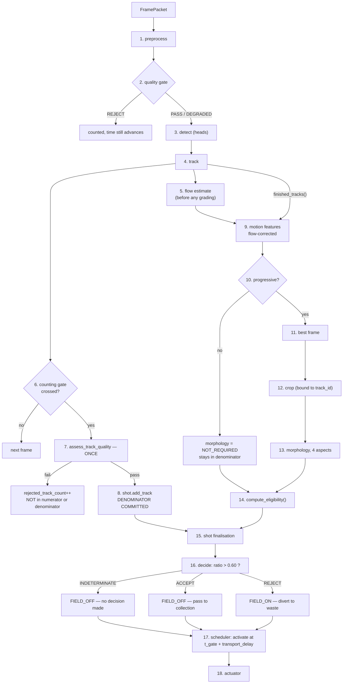

# Pipeline

The mandated processing order, stage by stage, and the invariants each stage
exists to protect. Component shapes and data contracts are in
`docs/architecture.md`; this document is about sequence and correctness.

---

## 0. The order

Implemented exactly once, in `runtime/pipeline.py`, so that live capture, replay
and synthetic runs all go through the same code:

```
frame
  -> preprocess -> quality gate
  -> detect (bounding boxes)
  -> track (persistent unique IDs)
  -> counting gate -> shot assignment          [denominator committed here]
  -> on track completion:
       motion features (flow-corrected)
       progressive classification
       if progressive:  best frame -> crop -> morphology (4 aspects)
       eligibility  (progressive AND all four normal AND in time)
  -> shot finalisation -> ratio -> decision
  -> scheduled FIELD_ON / FIELD_OFF
```



---

## 1. The four invariants

Everything below is in service of four statements. They are listed first because
each stage's design is an answer to one of them.

| # | Invariant | Where it is protected |
|---|---|---|
| **I1** | **One physical sperm is counted exactly once.** | Tracker ID uniqueness; `CountingGate._crossed` set; `ShotManager._assigned` set; `ShotRecord.add_track` returning `False` on a duplicate. |
| **I2** | **The crop belongs to the same tracked cell whose motion was measured.** | `CropRecord.track_id` duplicated onto the crop and checked in `CropExtractor.extract`, which raises `CropIdentityError` rather than proceeding. |
| **I3** | **Morphology never runs before tracking.** | `BestFrameSelector.select` raises `BestFrameOrderingError` on a track with no motion features or a non-progressive grade. |
| **I4** | **Track quality is assessed once, at the gate, and the verdict is final.** | `assess_track_quality` is called from exactly one place in `Pipeline.process_frame`, at the moment of the gate crossing. |

Each is defended structurally rather than by convention. Where the code could be
written either way, it is written the way that makes the violation fail loudly.

---

## 2. Stage by stage

### Stage 1 — Preprocess (`preprocessing/preprocessor.py`)

ROI crop, optional inversion, optional rolling-median background subtraction,
intensity normalisation.

Three properties are non-negotiable because this runs once per frame at up to
~164 Hz for hours: **bounded memory** (the background estimator owns exactly one
pre-allocated `(window, H, W)` buffer and overwrites slots in place),
**no mutation of the caller's array** (a second pass over the same recording
must see the same pixels, so any operation that changes values allocates; the
ROI crop returns a view, which is free and safe because it is never written to),
and **determinism** (no randomness, no time-dependent behaviour).

Output dtype policy: `normalize="none"` preserves the input integer dtype;
`minmax`, `zscore` and `clahe` produce `float32` in `[0, 1]`. Both forms are
legal downstream, and `to_unit_float` / `to_uint8` are the two canonical
converters so a single convention is applied everywhere.

### Stage 2 — Quality gate (`preprocessing/quality_gate.py`)

Three verdicts, three different consequences:

| Verdict | Effect |
|---|---|
| `PASS` | Usable for everything, including morphology crops. |
| `DEGRADED` | Feeds tracking (continuity matters more than a slightly soft frame) but **never eligible for a morphology crop**, enforced by `BestFrameConfig.require_frame_quality_pass`. |
| `REJECT` | Dropped; `metrics.frames_dropped_quality` incremented. |

A defocused frame still yields detections and still yields a velocity -- it just
yields a *wrong* one, and nothing downstream can tell the difference after the
fact. Rejecting the frame and counting the drop keeps the failure visible instead
of folding it into the result.

**Time still advances through a rejected frame.** `_advance_time_only` polls the
shot manager, finalises anything ready, and polls the scheduler, because a shot
must be able to time out during a run of unusable frames and the watchdog must
still see the pipeline as alive.

The gate runs on the *preprocessed* frame, not the raw one, because its
thresholds describe the image the detector will actually see. All measurements
are taken on a normalised 0-1 view, with one deliberate exception: the focus
score is reported in **8-bit-equivalent grey levels** (the normalised view is
multiplied by 255 before the Laplacian), because variance of Laplacian scales
with the square of the intensity scale and a 0-1 image would put the configured
thresholds around 1e-4.

### Stage 3 — Detect (`detection/`)

**The detection target is the sperm head, not the whole cell.** At the reference
sampling of 0.0345 um/px the field is 66.24 x 41.40 um while a whole
spermatozoon is 50-60 um long: it does not fit across the frame and fits along it
only when favourably oriented. A head at 4.1 x 2.8 um is ~119 x 81 px and always
fits. This is not a compromise -- CASA defines its kinematics on the head
centroid anyway, and MHSMA's crops are head-centred with the tail not entirely
visible. The full derivation is in `docs/assumptions.md` section 2.

Contract: boxes come back in **source-frame pixel coordinates**, with the
detector undoing its own resize, padding and tiling, because nothing downstream
knows the detector's internal geometry. An empty frame returns an empty list and
never raises.

Four implementations behind one interface: `p2net` (an FPN whose only prediction
level is P2, at stride 4), `todcnn` (never downsamples below stride 4; dilated
convolutions buy receptive field at constant resolution), `onnx` (the deployment
path), and `oracle` (reads the simulator's ground truth, with controllable miss,
false-positive and jitter rates, so that detector quality can be swept as an
independent variable). The oracle **never** writes the ground-truth track id into
`Detection.track_id` -- that would hand the tracker the answer -- it goes into
`Detection.meta["gt_track_id"]`, which evaluation code may read and the tracker
must not.

### Stage 4 — Track (`tracking/`)

The contract that matters is **identity** (I1). Three guarantees:

1. IDs are unique for the whole session and **never reused**, even after a track
   is removed. `TrackingConfig.reuse_track_ids` is typed `Literal[False]`, so no
   configuration can turn it on.
2. `update()` returns the **same** `TrackRecord` object for a given ID on every
   call, so a caller may hold a reference and watch it grow.
3. A point produced by the motion model rather than a measurement is appended
   with `observed=False`.

Observed points carry the **detector's** box, not the filter's. Smoothing is a
downstream choice; if the tracker smoothed first, downstream code would smooth a
smoothed signal and no one could tell how much of the reported velocity came from
the Kalman gain rather than from the sperm.

Trailing predicted points are dropped when a track is retired. A track dies
precisely because its predictions were never confirmed, so the `max_age` frames
of extrapolation at the end are supported by no measurement at all; keeping them
would push short tracks over `max_interpolated_fraction` and drop real sperm out
of the denominator. Interior gaps, which *are* bracketed by real observations,
are kept. The trim happens at the single instant a record becomes final, before
`finished_tracks()` hands it downstream, so no caller ever sees a live record
shrink.

Why ByteTrack is the default: a sperm that swims under a debris particle,
tumbles edge-on, or drifts through a dim patch does not vanish -- its detector
score collapses for a handful of frames. Discarding those frames breaks the
track, and **a broken track is two tracks**: the same sperm counted twice in the
denominator, with two half-length velocity estimates instead of one good one.
That is a direct I1 violation, and the low-score second association pass is what
prevents it.

BoT-SORT's camera-motion compensation is **off by default and should stay off**.
The camera is rigidly mounted, so whatever global image motion exists is the
*fluid* moving. CMC would have the tracker quietly absorb that motion into its
state transitions; the downstream flow estimator would then find little left to
remove and subtract a second, wrong correction, and the resulting velocity would
be neither raw nor corrected. Progressive motility is a velocity threshold, so
an uninterpretable velocity is an uninterpretable FIELD_ON/FIELD_OFF decision.

### Stage 5 — Flow estimate (`motion/flow.py`)

Run **before any track is graded**, so the same estimate applies to every track
on this frame.

What the camera sees is not swimming:

```
observed motion = self-propulsion + bulk transport by the fluid
```

and in a microfluidic channel the second term is usually larger. A dead,
entirely immotile sperm carried at 120 px/s traces a long, arrow-straight track
-- high VSL, LIN near 1 -- and uncorrected it is graded *rapid progressive*.
That is the single most consequential silent error available in this pipeline,
because it pushes non-viable cells into the accepted fraction.

Four modes (`FlowCorrectionMode`): `DISABLED` (still-fluid bench recordings
only), `FIXED_VECTOR` (one calibrated vector; a poor model near the walls, where
Poiseuille flow is much slower than mid-channel), `FLOW_MAP` (a calibrated
`(H, W, 2)` field, bilinearly sampled, which does respect the parabolic
profile), and `ROBUST_ESTIMATE` (the default: the slowest fraction of live tracks
is assumed passively transported and their *median* velocity is the bulk flow).
The robust estimator reports **unavailable** rather than guessing when fewer than
`robust_min_tracks` are present.

Whatever is subtracted is recorded in `MotionFeatures.flow_vx_px_s` /
`flow_vy_px_s`, and the raw kinematics are kept alongside the corrected ones, so
a reviewer can see how large the correction was and challenge it.

### Stage 6 — Counting gate (`shots/gate.py`)

The flow is physically continuous, so "a shot" has to be manufactured in
software. The gate is a virtual line across the channel, at
`position_fraction` (default 0.85) of the ROI extent along the flow axis, that
each track crosses exactly once on its way out.

**Downstream, not upstream, on purpose.** A track that has reached the
downstream edge has been observed for most of its transit, so its kinematics are
as complete as they will ever be at the moment it is committed to a shot. Gating
on entry would commit sperm to a decision unit before there was any evidence
about them.

A crossing is counted only when all three hold:

1. the track's centre moved from one side of the line to the other;
2. it moved in the configured flow direction; and
3. its **lifetime** displacement along the flow axis exceeds
   `min_axis_displacement_px`.

Condition (3) is what stops a cell loitering on the line from being counted
repeatedly -- a sperm jittering back and forth about the line has a near-zero
lifetime displacement and never qualifies. Condition (2) stops a cell swimming
upstream from being counted on its way back.

Independently of all three, a hard `set` of already-crossed track IDs makes
double-counting structurally impossible rather than merely unlikely. `forget()`
clears the position cache when a track finishes and deliberately **does not**
clear that set: forgetting that a track was counted is exactly how a sperm gets
counted twice.

The gate distinguishes "did not reach the line" from "crossed the wrong way" and
counts the latter, because a high wrong-direction count means the configured flow
direction is wrong and every shot is being mis-assembled.

### Stage 7 — Track quality, assessed once (`motion/classifier.assess_track_quality`)

At the crossing, and only there. The bar (`TrackQualityConfig`):

| Field | Default | Meaning |
|---|---|---|
| `min_observed_points` | 6 | measured, not predicted, observations |
| `min_duration_s` | 0.05 | observed lifetime |
| `max_interpolated_fraction` | 0.5 | ceiling on predicted points |
| `min_mean_score` | 0.25 | mean detector score over observed points |

A track that fails is **excluded from the shot entirely -- numerator *and*
denominator** -- because it is not a trustworthy observation of one sperm. It is
counted in `ShotRecord.rejected_track_count` so the operator can see how much of
the field is being discarded, and its gate crossing still extends the shot's
fluid segment.

This is a stricter thing than a bad grade, and the two are deliberately separate:
a *bad grade* means "a real sperm that did not qualify" and stays in the
denominator; a *quality failure* means "we do not know that this was one sperm"
and leaves.

**Invariant I4.** Assessing quality once, here, is what fixes the denominator at
the moment a track is committed. Re-assessing later and removing a track would
let the denominator shrink after the numerator was known -- which is the precise
manipulation that would make a bad sample look good. There is no code path that
removes a member from a shot.

### Stage 8 — Shot assembly (`shots/manager.py`)

A **shot** is a software-defined segment of the physically continuous flow: the
portion passing the imaging region containing, on average, 25 ± 5 uniquely
trackable sperm, treated as one independent AI decision unit.

Sizing (`constants.py`, not runtime-tunable because they define the product):

| Constant | Value |
|---|---|
| `TARGET_TRACKABLE_SPERM` | 25 |
| `MINIMUM_TRACKABLE_SPERM` | 20 |
| `MAXIMUM_TRACKABLE_SPERM` | 30 |
| `MAXIMUM_SHOT_DURATION_S` | 1.0 |

A shot closes on whichever fires first: `HARD_MAXIMUM` (30 reached),
`TARGET_REACHED` (25 reached), `TIMEOUT` (1.0 s elapsed), or `SHUTDOWN`.
`poll()` is called **every frame**, not only when a track is gated, because a
shot that stops receiving sperm entirely still has to time out -- otherwise an
empty channel stalls the controller indefinitely.

Two-phase lifecycle. **Assembly** adds tracks as they cross. **Finalisation**
waits: a closed shot still has members whose morphology is in flight, and it
becomes decidable when every member has resolved *or* when the morphology
deadline passes, whichever comes first. Collapsing the phases would force a
choice between deciding on incomplete data and blocking the pipeline; keeping
them apart lets the shot wait a bounded time and then decide honestly.

Members that never resolved are marked `DEADLINE_MISSED` and **stay in the
denominator**, because they were genuinely observed sperm that simply could not
be shown to qualify. Likewise a member the manager can no longer look up is
recorded as `MORPHOLOGY_INCOMPLETE` and kept: dropping it would inflate the ratio
by quietly shrinking the divisor.

A duplicate assignment is logged as a loud warning and refused rather than
raised, so a tracker defect degrades a single shot instead of stopping the run --
but `n_duplicate_assignments_rejected` is reported in `stats()`, because it
should always be zero.

### Stage 9 — Motion features (`motion/features.py`)

Runs on `finished_tracks()` -- tracks that can no longer grow. A track that never
crossed the gate belongs to no shot and is **not analysed at all**: it is in
nobody's denominator, so its morphology could not change any decision, and the
morphology budget is finite.

Five properties of the implementation are load-bearing:

1. **Only measured points are used.** Interpolated positions are the Kalman
   filter's opinion. Computing a velocity from them measures the filter, not the
   sperm, and does so in the *flattering* direction -- a constant-velocity
   predictor produces a perfectly straight, perfectly smooth segment, which
   inflates LIN and suppresses ALH.
2. **Real timestamps, never a nominal frame rate.** The achieved rate differs
   from the nominal one under load and the difference goes straight into every
   velocity.
3. **Pixels always; micrometres only when calibrated.** `vcl_um_s`, `vsl_um_s`
   and `vap_um_s` are `None` unless an optical calibration was loaded.
4. **Two frames of reference are retained**, raw and flow-corrected. Grading uses
   the corrected values; the raw ones are kept so the correction is auditable.
5. **The average-path window is a duration, not a frame count.**
   `MotionConfig.vap_window_ms` defaults to 100 ms and is converted per track
   against that track's own measured frame rate (17 frames at 160 fps, 5 at 50
   fps). A *fixed* five-frame smoother is what Mortimer et al. (2015) identify as
   producing "widely aberrant ALH values" when the frame rate changes.

ALH and BCF are refused below `min_fps_for_alh_bcf` (default 50) or
`min_points_for_alh_bcf` (default 15), and the refusal reason is recorded in
`alh_unavailable_reason` / `bcf_unavailable_reason` rather than a silent zero.
Note the attribution: **WHO specifies no numeric minimum frame rate**; ~60 Hz is
Mortimer et al. (2015). See `docs/safety_and_claims.md` section 5.

### Stage 10 — Progressive classification (`motion/classifier.py`)

On **flow-corrected** kinematics, in micrometres per second:

| Grade | Condition |
|---|---|
| `RAPID_PROGRESSIVE` | `VSL >= 25 um/s` and LIN sufficient |
| `SLOW_PROGRESSIVE` | `5 <= VSL < 25 um/s` and LIN sufficient |
| `NON_PROGRESSIVE` | `VSL < 5 um/s` but `VCL > immotile_vcl_um_s`; also any fast-but-not-linear cell demoted by the LIN floor |
| `IMMOTILE` | no motion above the calibrated noise floor |
| `UNDETERMINED` | the grade cannot be established |

The four grades and both limits are the WHO 6th edition's own, section 2.4.6.1 --
the edition that *reinstated* the four-category system the 5th had collapsed to
PR/NP/IM. WHO's PR is rapid+slow, NP is non-progressive, IM is immotile.

Two things this stage refuses to do:

**It refuses to grade without an optical calibration.** Micrometre-per-second
thresholds cannot be applied to pixel velocities, so the grade is `UNDETERMINED`
with a reason naming the missing calibration. Substituting pixels for
micrometres would be a fabricated physical measurement.

**It demotes rather than promotes when LIN is unavailable.** The LIN floor
(`min_lin_for_progressive`, default 0.35) is **stricter than WHO**, whose wording
admits progression "either linearly or in a large circle". It is this
implementation's choice, applied because the downstream action is a physical
sort and a large-circle swimmer does not reliably leave the imaging region.
Setting it to 0.0 disables the criterion entirely -- including the demotion for
an unavailable LIN -- for anyone who wants WHO's wording followed literally.

Temperature: WHO section 2.4.6 requires 37 C because velocity is
temperature-dependent. Out of specification, the grade is still produced -- a
room-temperature bench test is a legitimate thing to run -- but a
non-comparability note is appended to every reason string, and only to the
branches that actually applied a velocity threshold.

`UNDETERMINED` is not eligible. It is `MOTILITY_UNDETERMINED` in the
ineligibility histogram, and it stays in the denominator.

### Stage 11 — Best frame (`quality/selector.py`)

**Only after** a sperm has been confirmed progressive. `select()` raises
`BestFrameOrderingError` on a track carrying no motion features or a
non-progressive grade -- the API making the wrong order awkward on purpose, for
two reasons.

*Budget.* Morphology is the most expensive stage and has a per-track deadline.
Only progressive sperm can ever be `ai_eligible`, so selecting and cropping for
every track would spend the whole budget on cells disqualified before the model
is even asked.

*Binding (I2, I3).* Evaluating morphology before tracking means there is no track
to bind the crop to; the two measurements would have to be joined afterwards by
position or by time, which is exactly the kind of implicit join that silently
pairs one cell's shape with another cell's velocity in a crowded field.

The question this stage answers is different from stage 2's. Stage 2 asks "is
this frame usable at all"; this asks "of the frames in which *this* track was
actually seen, which gives the morphology model its best look at *this* cell". A
frame can be globally excellent and a poor look at one sperm that happens to be
overlapping a neighbour, clipped by the border, or smeared along its direction of
travel.

Eight terms, each mapped into `[0, 1]` and weighted (weights validated to sum to
1.0, so the composite is in `[0, 1]` by construction):

| Term | Weight |
|---|---|
| focus | 0.25 |
| motion blur | 0.20 |
| overlap | 0.15 |
| local contrast | 0.10 |
| exposure | 0.10 |
| truncation | 0.10 |
| detector score | 0.05 |
| track confidence | 0.05 |

Detector confidence is deliberately not dominant: a confidently-detected but
motion-blurred sperm is a bad morphology input. `BestFrameConfig` refuses
`w_detector_score >= 0.5`, and `validate_weights` closes the obvious loophole by
also refusing `w_detector_score + w_track_confidence >= 0.5` -- `track_confidence`
is the mean detector score, i.e. the same quantity averaged over time. The other
six terms are measured from pixels and geometry alone.

Only frames with an `observed=True` track point are considered. A predicted
position is the motion model's opinion about where the cell probably is, not
evidence that it appeared there; cropping at a predicted box would hand the model
a picture of the background.

The `FrameBuffer` exists because best-frame selection looks back over a whole
track, so frames must outlive the moment they were processed. It is sized to
`max(64, tracking.max_age * 4, 256)`. If a frame ages out before the crop is cut,
that is reported as `NO_VALID_CROP` **and** raises a health issue naming the
buffer capacity, because it means the buffer is too small for the track lengths
being produced.

### Stage 12 — Crop (`cropping/extractor.py`)

Two decisions are load-bearing.

**Aspect ratio is preserved by letterboxing, never by squashing.** Head
morphology keys on shape -- length against width is most of what distinguishes a
normal head from a tapered or amorphous one. Resizing a non-square crop to a
square input by stretching one axis changes that ratio by exactly the amount the
box was non-square, which is a systematic, shape-dependent distortion of the
single feature the model is being asked about. Letterboxing spends a few border
pixels instead.

**The crop is bound to its track (I2).** `CropRecord.track_id == TrackRecord.track_id`
is *checked* here, not assumed, and `extract` raises `CropIdentityError` if it
ever fails. A crop that silently ends up on the wrong track pairs one cell's
shape with another cell's velocity, and the resulting eligibility decision would
be wrong in a way no downstream check could detect.

Also recorded per crop: `truncated`, `visible_fraction`, `max_overlap_iou`, and a
best-effort `tail_complete`. Expect `tail_complete=False` frequently -- see
`docs/assumptions.md` on the field of view.

### Stage 13 — Morphology (`morphology/inference.py`)

Four **independent binary decisions**, never averaged into one score. One trunk,
four heads: the aspects share low-level texture and silhouette features, so
sharing the trunk is a 4x saving on the expensive part of the forward pass -- but
a sperm can be abnormal in any subset of the four, so this is four binary
problems, not one four-way classification, and each head gets its own logit, its
own `pos_weight` and its own decision threshold.

`forward` returns a `dict` keyed by aspect name rather than a `(B, 4)` tensor,
because the worst bug available here is an ordering bug that silently swaps the
4.6%-prevalence tail head with the 27%-prevalence head head, and a dict makes it
impossible to write.

**Label polarity.** Every logit the network emits is a logit for `P(abnormal)`,
so the training target is the MHSMA integer label verbatim -- no `1 - y`, no
`.flip()`, anywhere in the training path. The **one** flip to the schema's
`p_normal` happens in the inference adapter, through a single `flip_polarity`
function. Checkpoints and calibration bundles both record the polarity string and
refuse to load when it differs.

**Failure is never "normal".** The deadline can pass, there can be no usable
crop, and the backend can raise. All three return `MorphologyResult.failed` with
the matching status, which leaves all four aspects `None`, which makes
`is_complete` false, which makes `all_four_normal` false. There is no code path
that constructs an `AspectResult` without a real model output behind it.

Deadlines are checked against `time.monotonic`, never the wall clock: the point
is elapsed real time on a machine whose clock may step.

Per-aspect thresholds are mandatory (`MorphologyConfig` validates that all four
are present and lie strictly in `(0, 1)`). The shipped 0.5 values are a
**placeholder, not a calibration** -- with 4.6% of tails abnormal, 0.5 classifies
everything as normal and scores 95% accuracy while catching none of them.

### Stage 14 — Eligibility (`schemas/track.py::compute_eligibility`)

The per-sperm rule, implemented once. No other module is permitted to decide that
a sperm is `ai_eligible`.

```
ai_eligible = (1) valid unique track, gated
          AND (2) passed the track-quality bar
          AND (3) flow-corrected motility is progressive (rapid OR slow)
          AND (4) head, acrosome, vacuole and tail are ALL normal
          AND (5) the evaluation completed before its deadline
```

Note the asymmetry, which is the whole accounting model:

- Failing **(1) or (2)** removes the track from the shot entirely -- numerator
  *and* denominator. Handled by the shot manager, not here.
- Failing **(3), (4) or (5)** leaves the track in the **denominator**. It is a
  real observed sperm that simply did not qualify.

Every non-eligible member carries exactly one `IneligibilityReason`, so any
decision can be explained after the fact:

`TRACK_QUALITY_FAIL`, `NOT_PROGRESSIVE`, `MOTILITY_UNDETERMINED`,
`ABNORMAL_HEAD`, `ABNORMAL_ACROSOME`, `ABNORMAL_VACUOLE`, `ABNORMAL_TAIL`,
`MORPHOLOGY_INCOMPLETE`, `DEADLINE_MISSED`.

The morphology conjunction is checked with `first_abnormal_aspect()` in canonical
order, so the audit log names a concrete aspect rather than saying "morphology
failed". `all_four_normal` is never a mean, never an average of four
probabilities, and a **missing aspect is not normal**.

The term is `ai_eligible`, not "healthy". Section 7 of
`docs/safety_and_claims.md` explains why that distinction is not cosmetic.

---

## 3. The eligibility rule and the shot ratio, stated precisely

**Denominator** — `ShotRecord.trackable_count` = `len(track_ids)` = the number of
**unique valid trackable sperm** assigned to the shot. Every counted sperm: not
only the progressive ones, and not only the morphologically normal ones.

**Numerator** — `ShotRecord.ai_eligible_count` = `len(eligible_track_ids)` = the
subset satisfying all five clauses above.

**Ratio** — `ai_eligible_count / trackable_count`, or 0.0 for an empty shot.
Deliberately *not* divided by the progressive count, and abnormal sperm are
deliberately *not* removed from the denominator. Dividing by the progressive
count would measure "of the sperm that swim well, how many look good", which is a
different and much more flattering quantity than "of the sperm in this segment,
how many are good".

---

## 4. The decision rule, exactly

`decision/engine.py`, as a pure function -- no I/O, no state:

```python
if trackable_count < 20:
    shot_status  = "INDETERMINATE"
    field_command = "FIELD_OFF"
else:
    ratio = ai_eligible_count / trackable_count
    if ratio > 0.60:
        shot_status  = "ACCEPT"
        field_command = "FIELD_OFF"
    else:
        shot_status  = "REJECT"
        field_command = "FIELD_ON"
```

### 4.1 Exactly 60% is a REJECT

The comparison is a strict `>`. This is the product definition, not an
off-by-one, and it has been "fixed" into a bug before.

It is also implemented in **exact rational arithmetic**, not floating point.
0.60 has no exact binary representation, so a plain `ratio > 0.60` would rest on
the rounding of two separate floating-point conversions happening to agree. They
do agree today; making a hard product boundary depend on that is not worth the
risk when the alternative costs nothing:

```python
def exceeds_threshold(numerator: int, denominator: int, threshold: float) -> bool:
    if denominator <= 0:
        return False
    return Fraction(numerator, denominator) > Fraction(str(threshold))
```

Note `Fraction(str(threshold))`, not `Fraction(threshold)`. The latter would
capture the binary approximation (0.59999999999999997...) and make exactly-60%
compare as *above* threshold -- inverting the boundary case the rule exists to
pin down.

### 4.2 The five mandated boundary cases

| eligible / trackable | ratio | above 0.60? | status | field |
|---|---|---|---|---|
| **15 / 25** | 0.6000 | **no** | REJECT | **FIELD_ON** |
| **16 / 25** | 0.6400 | yes | ACCEPT | FIELD_OFF |
| **12 / 20** | 0.6000 | **no** | REJECT | **FIELD_ON** |
| **13 / 20** | 0.6500 | yes | ACCEPT | FIELD_OFF |
| **19 at timeout** | — | not evaluated | **INDETERMINATE** | FIELD_OFF |

15/25 and 12/20 are the two ways of writing exactly 60%, at the target shot size
and at the minimum. Both reject. 16/25 and 13/20 are the smallest increments
above them. 19 at timeout is one short of `MINIMUM_TRACKABLE_SPERM`: the ratio is
computed and reported, but it is not compared to the threshold at all, because a
ratio over 19 samples is not a reliable estimate. No sorting decision is made and
the field stays off.

The first four are the doctests on `exceeds_threshold`.

### 4.3 FIELD_ON is the rejection

**Energising the magnet diverts the labelled population toward the waste
channel.** The field is switched *on* for a segment the AI has judged poor; an
accepted segment is passed through with the field off.

Reading FIELD_ON as "good" inverts the product. Three corollaries:

- **FIELD_OFF is the safe state.** With the field off, the sample flows to
  collection unsorted -- the device degrades to "no sorting". With it stuck on,
  everything is silently diverted to waste. Every failure path in
  `actuation/` therefore ends in FIELD_OFF, `ActuationConfig.safe_state` is typed
  `Literal["FIELD_OFF"]` so no configuration can change it, the actuator is
  driven to it at startup before anything can decide otherwise, and the watchdog
  forces it when the pipeline hangs.
- **INDETERMINATE means FIELD_OFF**, i.e. "when in doubt, do not divert". The
  system does not sort what it could not measure.
- What the AI is judging is **visible phenotype only**. The magnetic separation
  acts on Annexin V binding, which this software does not and cannot observe. The
  two mechanisms are complementary, not equivalent -- see
  `docs/safety_and_claims.md`.

---

## 5. Scheduling the command

A shot describes a **segment of fluid, not an instant**. A rejected shot is
therefore energised from the moment its first member reaches the magnet until its
last member has passed, plus the configured margins:

```
FIELD_ON   at  first_gate_time_s + transport_delay
FIELD_OFF  at  last_gate_time_s  + transport_delay + post_activation_margin
```

An accepted shot needs no command at all when the field is already off --
re-asserting FIELD_OFF would add pointless actuator traffic -- but one is issued
whenever the current state is not already safe.

Per-command timeline (`scheduling/scheduler.py`):

```
t_gate      the shot's fluid segment passes the counting gate
t_activate  = t_gate + transport_delay              field must be in state
t_dispatch  = t_activate - settle_time - margin      command must leave here
t_deadline  = t_dispatch + late_tolerance            after this it is LATE
```

`settle_time` is the **rise** time for FIELD_ON and the **fall** time for
FIELD_OFF; using one for both biases every command in one direction.

Failure policy, in order of severity:

1. Dispatched later than its deadline → marked `LATE` and counted.
2. Already later than `drop_if_late_by_ms` (default 50 ms) → **dropped**, because
   firing it would gate the wrong fluid segment. Acting on the wrong segment is
   worse than not acting.
3. Superseded before dispatch → dropped as `SUPERSEDED`.
4. Watchdog not fed → FIELD_OFF regardless of what is queued.

**The scheduler refuses to arm while uncalibrated.** `transport_delay_ms`,
`field_rise_time_ms` and `field_fall_time_ms` all default to 0.0 with
`calibrated: false`, and `SchedulingConfig.require_calibrated()` raises
`CalibrationError`. Unknown physical timing is not a detail to be filled in with
a plausible number: a wrong transport delay applies the field to the wrong fluid,
which is a silent, invisible failure that would corrupt every sorted sample
without ever raising an error. `Application.setup()` arms the scheduler **last**,
and downgrades the failure to a warning only when the actuator is the mock.

---

## 6. Shutdown

`Pipeline.flush()` closes and decides everything outstanding: finished tracks are
finalised; tracks still alive but already gated are finalised too, so their shots
are not left waiting on a deadline that will never be fed; the open shot is
flushed if `flush_on_shutdown`; every pending shot is force-finalised, with
unresolved members marked `DEADLINE_MISSED`; and the scheduler queue is
discarded, because anything still queued describes fluid that has already passed.

`Application.close()` then drives the field off first, before releasing the
source, the detector or the audit log -- and it is idempotent and never raises,
because it runs on the path taken after another exception.
